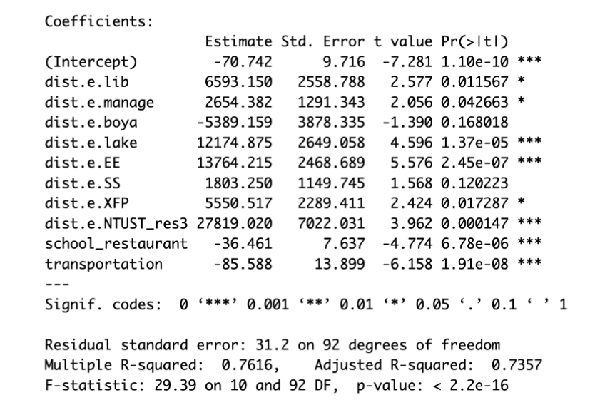

# Understanding the Spatial Patterns of  YouBike 2.0 at NTU

> **Final Project** 
> Introduction to Econometrics, Spring 2023

## Members 

- Bing-Chen Chiu (邱秉辰)
  - Double major in Information Management & Economics at NTU.
  - Data preprocessing (using Python), visualization, and discuss regression models.
- Kai-Jyun Wang (王愷均)
  - Major in Economics at NTU
  - Establishment and implementation (using R) of regression models.

## Motivation

[Renting/returning YouBike 2.0 in NTU campus can sometimes be troubling](https://www.thenewslens.com/article/186604/page3), and the situation of bike shortage at NTU has deteriorated in 2023 (Chin-Sum Shui, 2023). In this project, we try to understand the **spatial patterns** of ridership of YouBike at NTU and look for **determining factors** of riderships within and nearby NTU.

## Data Acquisition & Preprocessing

### Raw data of renting records

- [臺北市公共自行車 2.0 租借紀錄](https://data.taipei/dataset/detail?id=c5924c17-25db-4f1e-99c4-f8ada40f2445)

### Candidate stations

- 103 stations within and nearby NTU are **manually selected**.

### Preprocessing

- Data manipulation using **Pandas 2.0.14**
  - Subset the renting records that occurred on weekdays and both renting/returning station are
    belong to the list of selected 103 stations.
- Obtains geographical information by **Google Maps API**
  - latitude & longitude information
  - bicycling-distance between two given places
  - Nearest MRT station
  - Nearest dorm

### The Resulting Dataset

- We split a single day into 4 time segments:
  - A: Rent time between 07:00 - 10:59
  - B: Rent time between 11:00 - 14:59
  - C: Rent time between 15:00 - 18:59
  - D: Rent time between 19:00 - 23:59
- For each station, we have:
  - The official *name* of this YouBike 2.0 station and its capacity
  - The *latitude & longitude* of the station
  - The total *flow* of each time segment
  - The *bicycling-distances* to our selected *landmarks*

- We also construct a table of bicycling-distances between each pair of stations.

- Remark: The difinition of *flow*

  A flow of station $i$ at time segment $t$ is:
  $$
  FR_i^t = \frac{RE_i^t - RT_i^t}{C_i}
  $$

  - $RE_i^t$ denotes the total number of \textbf{rents} from station $i$ at time segment $t$.
  - $RT_i^t$ denotes the total number of \textbf{returns} to station $i$ at time segment $t$.
  - $C_i$ denotes the capacity of station $i$.
  - $i \in \{0,...,103\}, \ t \in \{A,B,C,D\}$.	

## Data Visualization

> We use [foursquare studio](https://studio.foursquare.com/public/5041dc36-77a7-42ab-9c09-50eb86f7ea67) as our main visualization tool
>
> - Red dot means the station tends to "flow out"
> - Blue dot means the station tends to "flow in"
> - The thickness of the line represents the ridership

### Time A - Tend to flow into the campus

### Time B - Mixed (also less rides)

### Time C - Tend to flow out of the campus

### Time D - Back to the dorms

## The Regression Model

### Ordinary Least Squares

Consider an OLS model
$$
FR_{i}^t = \alpha_t+D_i\:\beta_{t}+\varepsilon_{it}
$$

where $D_i\:\beta_t$ is the spatial fixed effect regarding the facilities nearby. 

### Spatial Lag Model

Consider a SLM. 
$$
    FR_{i}^t = \rho W_iFR_{t}+\alpha_t+D_i\:\beta_t+\varepsilon_{it}
$$
where $W_i$ is the ith row of $W$ defined above and $D_i$ are the distances from station $i$ to the predetermined landmarks.

### The List of Predefined Landmarks

## Results

### Ordinary Least Squares 

### Ordinary Least Squares  with $D^e = \frac{1}{1+D}$

### Step AIC Results by backward selection

#### Time A

#### Time B

#### Time B (with SLM)

#### Time C

#### Time D

## Conclusion

- If there is a good reason to consider geographic factors in the model, the spatial autocorrelation can be captured.
- Our model shows some characteristics:
  - Flow into the campus in the morning and flow out in the afternoon (MRT, conversely)
  - Flow into the dorm area shows insignificant results.

